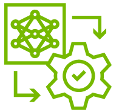

# MDM-Lernjournal <`Ravinsen`>

## Inhalt

* [Lernjournal 1 Python](lernjournal1-python/README.md)
* [Lernjournal 2 Container](lernjournal2-container/README.md)
* [Lernjournal 3 ONNX](lernjournal3-onnx/README.md)
* [Lernjournal 4 UI](lernjournal4-ui/README.md) => entfällt
* [Projekt 1 Python](projekt1-python/README.md)
* [Projekt 2 Java](projekt2-java/README.md)
* [Review 1 Python](review1-python/README.md)
* [Review 2 Java](review2-java/README.md)

## Schlussteil

### Reflexion, Zusammenfassung

Das Modul Model Deployment & Maintenance war für mich inhaltlich sehr bereichernd. Besonders spannend fand ich die Verbindung von Softwareentwicklung mit maschinellem Lernen und modernen Deployment-Techniken auf Azure. Mein Verständnis für den gesamten Prozess – von der Datenaufbereitung bis zur produktiven Webanwendung – konnte ich deutlich vertiefen.

Die Projekte mit Python und Java waren anspruchsvoll, aber praxisnah. Ich habe zahlreiche Tools wie VS Code, GitHub Actions, Docker, Azure und MongoDB im konkreten Anwendungskontext kennengelernt.

Der Zeitaufwand für Projekt 1, Projekt 2 und das Lernjournal belief sich insgesamt auf rund 100 Stunden (exkl. Vorlesungen), was den Rahmen eines 3-ECTS-Moduls deutlich übersteigt. Insbesondere die Lernjournale 1 bis 3 hätten entfallen können, da sie sich inhaltlich stark mit den beiden Projekten überschnitten. Aus meiner Sicht hätten zwei Lernjournale auf Basis der Projekte ausgereicht oder das Modul hätte mit 6 ECTS bewertet werden sollen.

Trotz der hohen Arbeitsbelastung ziehe ich ein positives Fazit: Ich nehme wertvolle praktische Erfahrungen mit und konnte zwei vollständig funktionierende Anwendungen umsetzen.

### Feedback zur Vorlesung (optional)

Die Inhalte des Moduls waren praxisnah und die Vermittlung war in den meisten Fällen klar und nachvollziehbar. Die Aufzeichnungen waren hilfreich, besonders wenn man während der Vorlesung nicht folgen konnte. Allerdings war der Umfang pro Vorlesung so hoch, dass kaum Raum für Fragen blieb. Wer einmal aus dem Rhythmus geriet, konnte in der Live-Session kaum aktiv mitarbeiten und musste den Stoff nachträglich selbst aufarbeiten.

Unklar war für viele zu Beginn, wie genau die Lernjournale und Projekte umzusetzen sind. Ein konkretes Beispiel für ein vollständiges Lernjournal oder Projekt 1/2 hätte hier enorm geholfen. Auch die Aufgabenstellungen waren teilweise ungenau formuliert und führten zu Unsicherheiten, was zu tun ist. Dass relevante Codebeispiele teilweise nur im Webex gezeigt wurden, aber nicht in den PDFs enthalten waren, machte die Nachbereitung zusätzlich aufwendig.

Trotz dieser Punkte war es ein lehrreiches Modul mit hohem Anwendungsbezug.

## Regeln Lernjournal

### Repository
* Eigenes *privates* Haupt-Repository basierend auf dieser Vorlage erstellen
* Weitere *private* Repositories je nach Aufgabenstellung erstellen
* Alle Repositories müssen an [mosazhaw] (https://www.github.com/mosazhaw) freigegeben sein

### Struktur
* Kapitelstruktur inkl. Nummerierung einhalten (die Reihenfolge, Struktur und Bezeichnung der Titel und Untertitel darf nicht verändert werden)
* Es dürfen weitere Untertitel (4. Ebene mit ####) ergänzt werden

### Inhalt
* Deutsch, Markdown
* Inhaltsverzeichnis und URL zu Repositories und Webseiten müssen klickbar sein (Links)
* [ ] TODO bezeichnet Stellen, wo Text und/oder Grafiken/Screenshots ergänzt werden sollen
* Vorgegebene Tabellen zu Beginn der jeweiligen Kapitel müssen belassen werden

### Bilder, Grafiken und Screenshots
* Es dürfen keine externen Bilder, Grafiken oder Screenshots verknüpft werden
* Bilder, Grafiken und Screenshots müssen alle im jeweiligen Unterordner "images" abgelegt *und im Bericht sichtbar verknüpft* werden, ein Beispiel:

### Nachvollziehbarkeit Eigenständigkeit

* Verwendung des eigenen Kürzels/Namen/Accounts in Projektnamen, Datei-Pfaden, Repositories, Docker-Images, Docker-Containern und weiteren wählbaren Bezeichnungen
* Sichtbarkeit des eigenen Kürzels/Name/Accounts auf Screenshots
* Screenshots passend zu aktuellem Datum, verwendeter Hard-/Software, Versionen
* Inhalte Projektbericht passend zu Screencast

