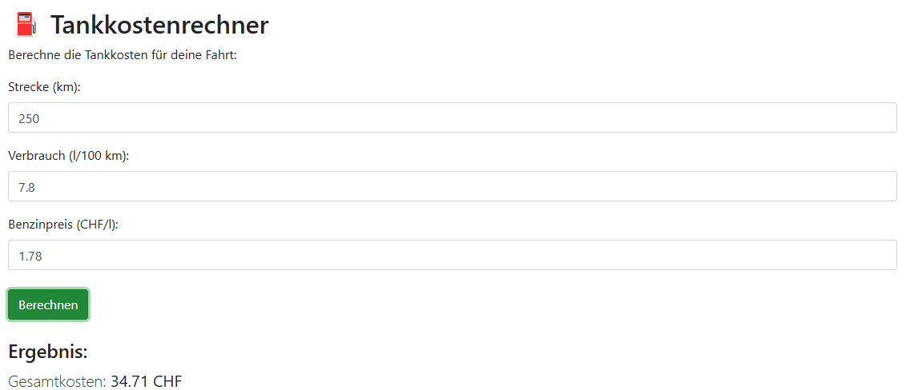

# Lernjournal 1 Python  
**Modul: Model Deployment & Maintenance**  
**Lernjournal-Thema: Tankkostenrechner**  
**Erfasst von: Senthujan Ravindran / ravinsen**

---

## Repository und Library

| Bestandteil | Beschrieb, Fundort |
|-------------|------------------------------------------------------------|
| Repository (URL) | https://github.com/Ravinsen/Tankkostenrechner |
| Kurze Beschreibung der App-Funktion | Berechnet die Tankkosten basierend auf Strecke, Verbrauch und Benzinpreis |
| Verwendete Library aus PyPi (Name) | flask |
| Verwendete Library aus PyPi (URL) | https://pypi.org/project/Flask/ |
| Location deployed Application | https://tankkostenrechner-app.azurewebsites.net |

---

## App, Funktionalität

Die Webanwendung **Tankkostenrechner** erlaubt es, die geschätzten Kosten einer Autofahrt zu berechnen. Der Benutzer gibt drei Werte ein:

- Strecke in Kilometern
- Verbrauch in Litern pro 100 Kilometer
- Benzinpreis pro Liter (CHF)

Die App berechnet auf Knopfdruck die Tankkosten in CHF (Formel: Kosten = (Strecke / 100) × Verbrauch × Preis). Die einfache Logik wird mit Flask im Backend umgesetzt, das Frontend basiert auf HTML, Bootstrap und Vanilla JavaScript.

---

## Dependency Management

- Verwendet wurde eine minimale `requirements.txt` mit einer Abhängigkeit:
  
  ```txt
  flask
  ```

- Die virtuelle Umgebung wurde mit venv erstellt (.venv)
- Es wurde keine virtuelle Umgebung auf Azure mitgeliefert (.venv ausgeschlossen)
- Die requirements.txt wurde manuell gepflegt


---

  ## Deployment

Das Deployment erfolgte über **Azure Web App Service** mit **Local Git Deployment** über das Azure Webportal.


### 1. Web App über Azure-Portal erstellt

- App-Name: `tankkostenrechner-app`
- Region: `South India`
- Laufzeit: `Python 3.11 (Linux)`
- Standarddomäne: `tankkostenrechner-app-hucmg8c6d7hgc7cq.southindia-01.azurewebsites.net`


---

### 2. Local Git aktiviert & Credentials gesetzt

- SCM-Authentifizierung wurde manuell aktiviert
- Benutzername und Passwort im Deployment Center festgelegt
- Git-URL wurde anschliessend angezeigt: `https://tankkostenrechner-app-hucmg8c6d7hgc7cq.scm.southindia-01.azurewebsites.net:443/Tankkostenrechner-App.git`


---

### 3. Lokaler Push über Git

Im lokalen Projektordner wurde das Repository initialisiert, mit Azure verknüpft und gepusht:

```bash
az login
git init
git remote add azure https://tankkostenrechner-app.scm.azurewebsites.net/tankkostenrechner-app.git
git add .
git commit -m "Initial deploy"
git push azure main:master
```

```txt
C:\Users\senth\MDM-Projects\Tankkostenrechner> git push azure main:master
Enumerating objects: 23, done.
Counting objects: 100% (23/23), done.
Delta compression using up to 8 threads
Compressing objects: 100% (17/17), done.
Writing objects: 100% (23/23), 4.12 KiB | 2.06 MiB/s, done.
Total 23 (delta 5), reused 0 (delta 0), pack-reused 0
remote: Updating branch 'master'.
remote: Updating submodules.
remote: Preparing deployment for commit id 'abc123def456...'.
remote: Deployment successful.
To https://tankkostenrechner-app.scm.azurewebsites.net:443/tankkostenrechner-app.git
 * [new branch]      main -> master
```
Der Protokollstream sieht nach erfolgreichen Deployment folgendermassen aus:
```txt
Verbunden!
2025-04-24T07:56:19  Welcome, you are now connected to log-streaming service.Starting Log Tail -n 10 of existing logs ----/appsvctmp/volatile/logs/runtime/container.log
2025-04-24T07:13:41.4400979Z [2025-04-24 07:13:41 +0000] [1036] [INFO] Booting worker with pid: 1036
2025-04-24T07:13:43.4365033Z 169.254.129.1 - - [24/Apr/2025:07:13:43 +0000] "GET /robots933456.txt HTTP/1.1" 404 207 "-" "HealthCheck/1.0"
2025-04-24T07:13:44.2158327Z 169.254.129.1 - - [24/Apr/2025:07:13:44 +0000] "GET /robots933456.txt HTTP/1.1" 404 207 "-" "HealthCheck/1.0"
2025-04-24T07:13:44.6679295Z 169.254.129.1 - - [24/Apr/2025:07:13:44 +0000] "GET / HTTP/1.1" 200 0 "https://sandbox-1.reactblade.portal.azure.net/" "Mozilla/5.0 (Windows NT 10.0; Win64; x64) AppleWebKit/537.36 (KHTML, like Gecko) Chrome/135.0.0.0 Safari/537.36 Edg/135.0.0.0"
2025-04-24T07:13:44.8665974Z 169.254.129.1 - - [24/Apr/2025:07:13:44 +0000] "GET /script.js HTTP/1.1" 200 0 "https://tankkostenrechner-app-hucmg8c6d7hgc7cq.southindia-01.azurewebsites.net/" "Mozilla/5.0 (Windows NT 10.0; Win64; x64) AppleWebKit/537.36 (KHTML, like Gecko) Chrome/135.0.0.0 Safari/537.36 Edg/135.0.0.0"
2025-04-24T07:13:45.4995148Z 169.254.129.1 - - [24/Apr/2025:07:13:45 +0000] "GET /favicon.ico HTTP/1.1" 404 207 "https://tankkostenrechner-app-hucmg8c6d7hgc7cq.southindia-01.azurewebsites.net/" "Mozilla/5.0 (Windows NT 10.0; Win64; x64) AppleWebKit/537.36 (KHTML, like Gecko) Chrome/135.0.0.0 Safari/537.36 Edg/135.0.0.0"
2025-04-24T07:13:49.5416097Z 169.254.129.1 - - [24/Apr/2025:07:13:49 +0000] "GET / HTTP/1.1" 200 0 "-" "ReadyForRequest/1.0 (LocalCache)"
2025-04-24T07:13:49.5500843Z 169.254.129.1 - - [24/Apr/2025:07:13:49 +0000] "GET / HTTP/1.1" 200 0 "-" "ReadyForRequest/1.0 (AppInit)"
2025-04-24T07:16:51.5939080Z 169.254.129.1 - - [24/Apr/2025:07:16:51 +0000] "POST /calculate HTTP/1.1" 200 17 "https://tankkostenrechner-app-hucmg8c6d7hgc7cq.southindia-01.azurewebsites.net/" "Mozilla/5.0 (Windows NT 10.0; Win64; x64) AppleWebKit/537.36 (KHTML, like Gecko) Chrome/135.0.0.0 Safari/537.36 Edg/135.0.0.0"
2025-04-24T07:56:14.6343140Z 169.254.129.1 - - [24/Apr/2025:07:56:13 +0000] "GET /admin/host/status HTTP/1.1" 404 207 "-" "Mozilla/5.0 (Windows NT 10.0; Win64; x64) AppleWebKit/537.36 (KHTML, like Gecko) Chrome/135.0.0.0 Safari/537.36 Edg/135.0.0.0"Ending Log Tail of existing logs ---Starting Live Log Stream ---
```

### 4. Live Test der Anwendung

Die Anwendung ist live erreichbar unter:
https://tankkostenrechner-app-hucmg8c6d7hgc7cq.southindia-01.azurewebsites.net/



---

### Fazit & Reflexion

Die Umsetzung eines eigenen Tankkostenrechners war trotz geringer Komplexität sehr lehrreich. Ich konnte den vollständigen Prozess von der lokalen Flask-App bis zum Azure Deployment nachvollziehen und umsetzen.
