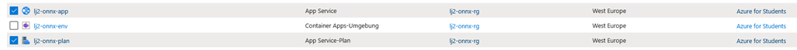
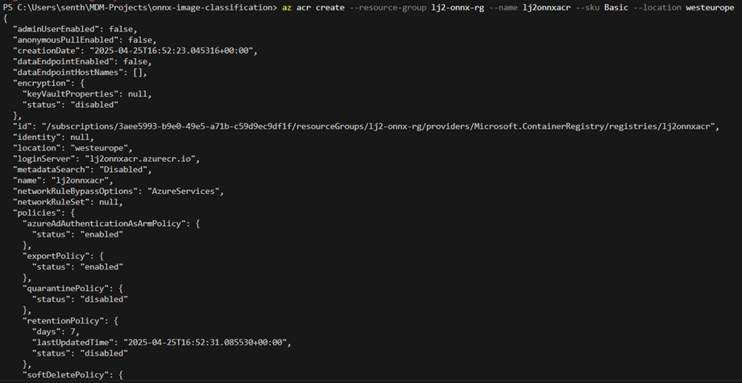

# Lernjournal 2 Container

## Docker Web-Applikation

### Verwendete Docker Images

| | |
| -------- | ------- |
| Image 1 | traccar/traccar:latest |
| Image 1 – URL Docker Hub | https://hub.docker.com/r/traccar/traccar |
| Image 2 | mysql:5.7 |
| Image 2 – URL Docker Hub | https://hub.docker.com/_/mysql |
| Docker Compose | https://github.com/Ravinsen/-MDM-Lernjournal/blob/main/lernjournal2-container/docker-compose.yml |

### Dokumentation manuelles Deployment

Ziel war es, eine bestehende Container-Web-Applikation mit mindestens zwei Containern zu recherchieren, manuell und via Docker Compose zu deployen. Ich habe mich für das Fahrzeug-Ortungssystem Traccar entschieden, da es eine moderne GPS-Tracking-Plattform ist.

Die Anwendung Traccar besteht aus zwei verbundenen Containern:

– Traccar-Webserver  
– MySQL-Datenbank


### Dokumentation Docker-Compose Deployment

Als erstes wurde das  <a href="docker-compose.yml">docker-compose.yml</a> erstellt mit den Anwendungen Traccar und MySQL. Das docker-compose File braucht es, um mehrere Container gemeinsam gestartet werden können.

Um zu starten wurde folgender Befehlt im Terminal ausgeführt:

 ```txt
  docker-compose up -d
  ```


Nach erfolgreichem Laden war die Traccar-Seite über den Localhost (http://localhost:8082) erreichbar. Nach der Registrierung konnte die Hauptseite ebenfalls erfolgreich geöffnet werden.


Nun zum Schluss kann die Applikation beendet und der Container entfernt werden. Dazu wird folgender Code ausgeführt:

 ```txt
  docker-compose down
  ```


## Deployment ML-App

### Variante und Repository

| Gewähltes Beispiel | Bitte ausfüllen |
| -------- | ------- |
| onnx-sentiment-analysis | Nein |
| onnx-image-classification | Ja|
| Repo URL Fork | https://github.com/Ravinsen/onnx-image-classification |
| Docker Hub URL | https://hub.docker.com/repository/docker/ravinsen/onnx-image-classification |

### Dokumentation lokales Deployment

Für den zweiten Teil habe ich mich für die `onnx-image-classification` entschieden. Im diesen Teil liegt der Schwerpunkt im lokalen Deployment einer Machine Learning App, welche von diesem Repository zu Verfügung gestellt wurde https://github.com/mosazhaw/onnx-image-classification. Das Repository wurde wie gewohnt geforkt und geclont.

Danach wurde das Docker-Image für die onnx-image-classification-App lokal erstellt und geprüft, ob die Webanwendung funktioniert.

1. Für das lokale Deployment wurde `docker build` ausgeführt.
  ```txt
  docker build -t onnx-image-classification .
  ```


2. Danach wird der Container mit `docker run` gestartet.
```txt
docker run --name onnx-image-classification -p 9000:5000 -d onnx-image-classification`. 
```


3. Und das Docker Image wurde erstellt, dies ist im Docker Desktop ersichtlich.

 

4. Nun ist das Modell über den Localhost `http://localhost:9000` erreichbar.

  

5. Zum Schluss wird mit `docker login` Docker-Client auf Docker Hub authentifiziert, das Docker Image getaggt `docker tag` und das Image auf Docker Hub veröffentlicht `docker push`.
```txt
docker login
docker tag onnx-image-classification ravinsen/onnx-image-classification:latest
docker push ravinsen/onnx-image-classification:latest
  ```


### Dokumentation Deployment Azure Web App

Nach erfolgreichem lokalen Test wurde das Image in die Azure Cloud auf einen Azure App Service deployed. Ziel war es, die ML-App als skalierbare Web-App über eine öffentlich erreichbare URL verfügbar zu machen.

1. Der erste Schritt ist die Erstellung einer Resourcengruppe mit `az group create`. Ich habe mich für das Aufsetzen mit CLI entschieden.
```txt
az group create --name lj2-onnx-rg --location westeurope
```


2. Nun wird die App Service Plan erstellt `az appservice plan create` und anschliessend die Web App mit dem Docker Hub Image erstellt `az webapp create`.
```txt
az appservice plan create --name lj2-onnx-plan --resource-group lj2-onnx-rg --sku F1 --is-linux
az webapp create --resource-group lj2-onnx-rg --plan lj2-onnx-plan --name lj2-onnx-app --deployment-container-image-name ravinsen/onnx-image-classification:latest
```


3. Nun wurden alle Resourcen erstellt und die App ist über Azure erreichbar https://lj2-onnx-app.azurewebsites.net/.




### Dokumentation Deployment ACA

Nach erfolgreichem Test auf Azure App Service wurde die ML-App zusätzlich als Azure Container App (ACA) deployed, um eine containerisierte, dynamisch skalierbare Lösung zu testen. Für das Deployment wurde die Resourcengruppe `lj2-onnx-rg` verwendet.

1. Um als Azure Container App zu deployeen muss eine Azure Container App Environment erstellt werden, der Befehl `az containerapp env create` hat nicht auf Anhieb funktioniert, da Azure Container Apps ein Log Analytics Workspace benötigt und der dafür zuständige Resource Provider in meiner Subscription noch nicht registriert war. Deshalb musste ich noch `az provider register` ausführen und den `az containerapp env create`-Befehl nochmals laufen lassen.
```txt
az containerapp env create --name lj2-onnx-env --resource-group lj2-onnx-rg --location westeurope
az provider register -n Microsoft.OperationalInsights --wait
```


2. Nun wird noch die ACA Container App erstellt `az containerapp create`. Nach der Erstellung ist die App erreichbar über diesen Link: https://lj2-onnx-aca.delightfulsand-6aa09a58.westeurope.azurecontainerapps.io/
```txt
az containerapp create --name lj2-onnx-aca --resource-group lj2-onnx-rg --environment lj2-onnx-env --image ravinsen/onnx-image-classification:latest --target-port 5000 --ingress external --query properties.configuration.ingress.fqdn
```


### Dokumentation Deployment ACI

Ziel war es, das ML-Modell als einzelne Azure Container Instance (ACI) bereitzustellen. Anfangs sollte das Image direkt von Docker Hub geladen werden, was jedoch aufgrund Verbindungsproblemen scheiterte. Deshalb wurde alternativ ein Azure Container Registry (ACR) aufgebaut und genutzt.

1. Ursprünglicher Ansatz: Deployment mit Docker Hub. Versuch eines direkten Deployment von Dock Hub mit `az container create`. Leider ist dies gescheitert, da keine Verbindung zwischen Azure und Docker Hub hergestellt werden konnte.
```txt
az container create --resource-group lj2-onnx-rg --name lj2-onnx-aci --image ravinsen/onnx-image-classification:latest --dns-name-label lj2onnxaci --ports 5000 --location westeurope --os-type Linux --cpu 1 --memory 1.5
```


2. Da das Docker-Image in einer privaten Azure Container Registry (ACR) gespeichert war, mussten beim Deployment auf Azure Container Instance (ACI) zusätzliche Registry-Zugangsdaten (--registry-login-server, --registry-username, --registry-password) angegeben werden, um das Image erfolgreich zu ziehen. Dafür musste nacheinander folgende Befehle ausgefärt werden:
   - `az acr create` -> Erstellt die Azure Container Registry
   - `az acr login` -> In ACR einloggen
   - `docker tag` -> Docker-Image taggen
   - `docker push` -> Docker-Image pushen
   - `az acr update` -> Admin-Login aktivieren
   - `az acr credential show` -> Zeigt die Zugangsdaten an, die für --registry-username und --registry-password nötig sind

 ```txt
az acr create --resource-group lj2-onnx-rg --name lj2onnxacr --sku Basic --location westeurope
az acr login --name lj2onnxacr
docker tag ravinsen/onnx-image-classification:latest lj2onnxacr.azurecr.io/onnx-image-classification:v1
docker push lj2onnxacr.azurecr.io/onnx-image-classification:v1
az acr update -n lj2onnxacr --admin-enabled true
az acr credential show --name lj2onnxacr
```



2. 
