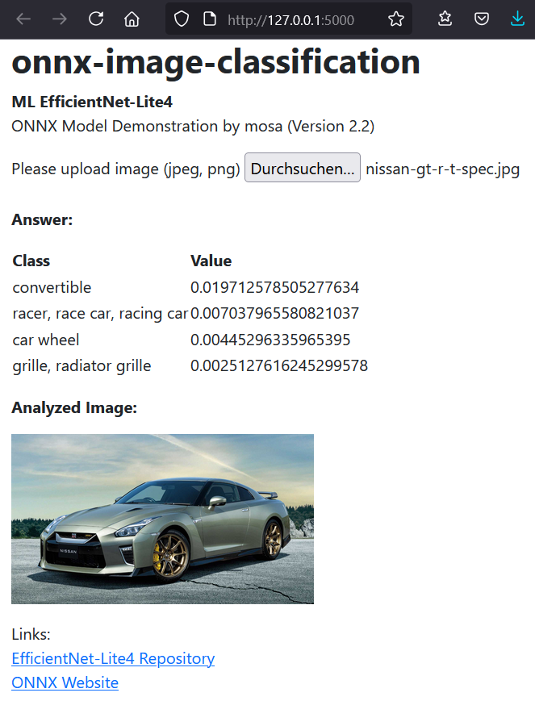
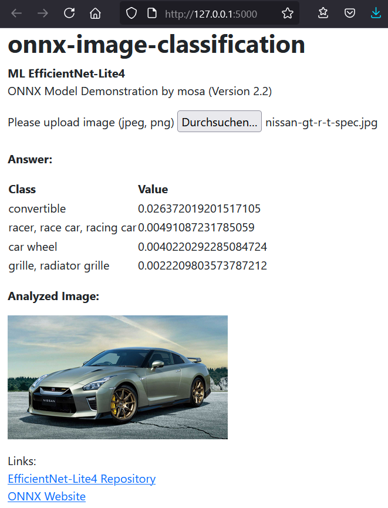
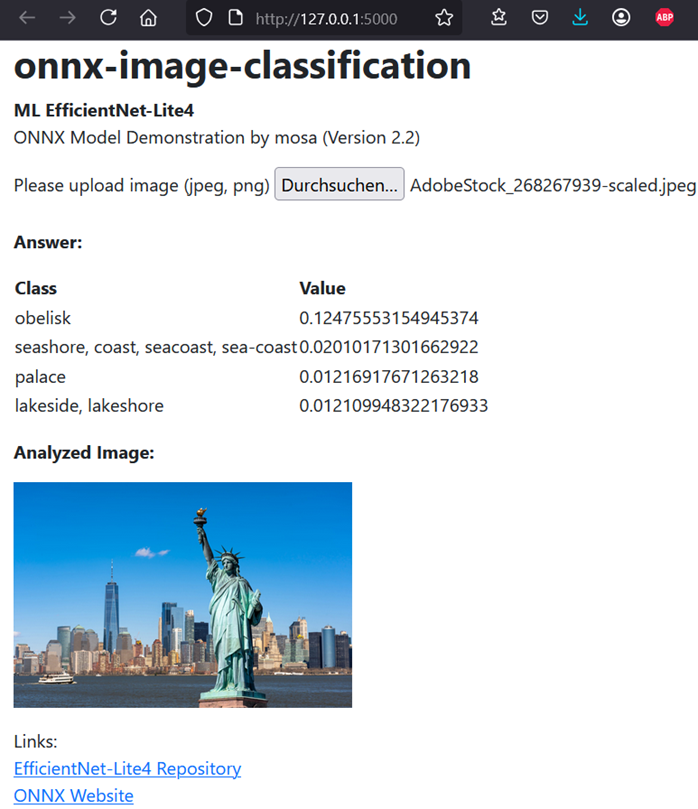
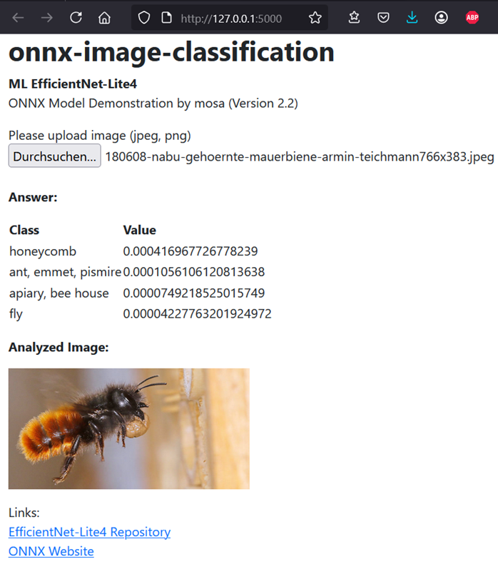
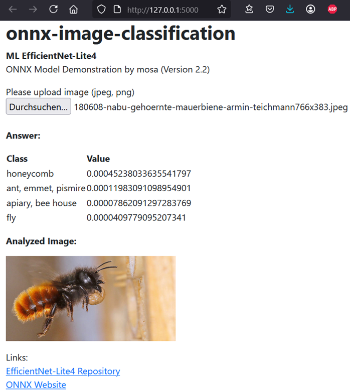

# Lernjournal 3 ONNX

## Übersicht

| | Bitte ausfüllen |
| -------- | ------- |
| ONNX Modell für Analyse (Netron) | https://netron.app/ |
| onnx-image-classification Fork (EfficientNet-Lite) | https://github.com/Ravinsen/onnx-image-classification |

## Dokumentation ONNX Analyse

Ziel dieses Lernjournals war es, die Idee von ONNX zu verstehen und die Verwendung der ONNX-Runtime zu erproben. Hierfür wurde das Modell EfficientNet-Lite4-11-int8 verwendet und mit EfficientNet-Lite4-11 verglichen. Das Modell wurde auf eigenen Bildern getestet und die Ergebnisse dokumentiert.

### Modelwahl

Gewählt wurde das Modell EfficientNet-Lite4-11-int8 aus dem ONNX Model Zoo. Es handelt sich um eine kompakte Version eines CNNs mit quantisierten INT8-Gewichten, ideal geeignet für mobile Inference. Das Modell hat eine Top-1 Accuracy von 77,56% bei nur 13 MB Modellgröße.

### Netron Analyse des EfficientNet-Lite4-11-int8 Modells

Das Modell verarbeitet Eingabebilder in einer Größe von 224x224 Pixeln mit drei Farbkanälen (RGB). Es besteht aus mehreren aufeinanderfolgenden Bausteinen, die typische Schritte der Bilderkennung übernehmen: Merkmale werden zuerst extrahiert, anschliessend normalisiert und durch Aktivierungsfunktionen verstärkt. Am Ende des Modells wird das Bild auf eine kompakte Form reduziert, bevor eine Zuordnung zu einer von 1000 möglichen Klassen erfolgt. Die Ausgabe ist eine Wahrscheinlichkeitsverteilung über diese Klassen.

Trotz der reduzierten Modellgröße durch INT8-Quantisierung erreicht das Modell gute Erkennungsraten, was sich auch in den eigenen Tests widerspiegelt. Insgesamt zeigt die Analyse eine typische Architektur für effiziente Modelle wie MobileNet oder EfficientNet, bei denen ein ausgewogenes Verhältnis zwischen Genauigkeit und Ressourcenverbrauch im Vordergrund steht.

Hier ist die Abbildung in Netron ersichtlich: [Netron_Analyse_efficientnet-lite4-11-int8.onnx](images/Netron_Analyse_efficientnet-lite4-11-int8.onnx.png)

## Dokumentation onnx-image-classification

In diesem Teil des Lernjournals wurde das ONNX-Modell EfficientNet-Lite4-11-int8 verwendet, um eine Bildklassifikation durchzuführen. Ziel war es, eigene Bilder hochzuladen und diese vom Modell automatisch klassifizieren zu lassen. Zusätzlich wurde ein Vergleich zum nicht-quantisierten Modell EfficientNet-Lite4-11 erstellt, um die Unterschiede in den Vorhersagen zu analysieren.

### Modellvergleich

Insgesamt wurden drei verschiedene Bilder ausgewählt und jeweils mit beiden Modellen getestet. Folgende Auswertung konnte festgestellt werden:

| Bild                | Modell         | Top-1 Prediction | Confidence (%) |
|:--------------------|:---------------|:-----------------|:---------------|
| Auto (Nissan GT-R)   | Lite4-11-int8   | convertible       | 1.97 %         |
| Auto (Nissan GT-R)   | Lite4-11        | convertible       | 2.63 %         |
| Freiheitsstatue      | Lite4-11-int8   | obelisk           | 9.58 %         |
| Freiheitsstatue      | Lite4-11        | obelisk           | 12.48 %        |
| Biene                | Lite4-11-int8   | honeycomb         | 0.04 %         |
| Biene                | Lite4-11        | honeycomb         | 0.05 %         |

- Beim Vergleich beider Modelle fällt auf, dass die Predictions übereinstimmen.
- Das nicht-quantisierte Modell (Lite4-11) erreicht jedoch meist leicht höhere Confidence-Werte.
- Dies ist logisch, da quantisierte Modelle (INT8) minimal an Genauigkeit verlieren, dafür aber kleiner und schneller sind.

### Bilder 

EfficientNet-Lite4-11-int8

EfficientNet-Lite4-11

EfficientNet-Lite4-11-int8

EfficientNet-Lite4-11

EfficientNet-Lite4-11-int8

EfficientNet-Lite4-11

