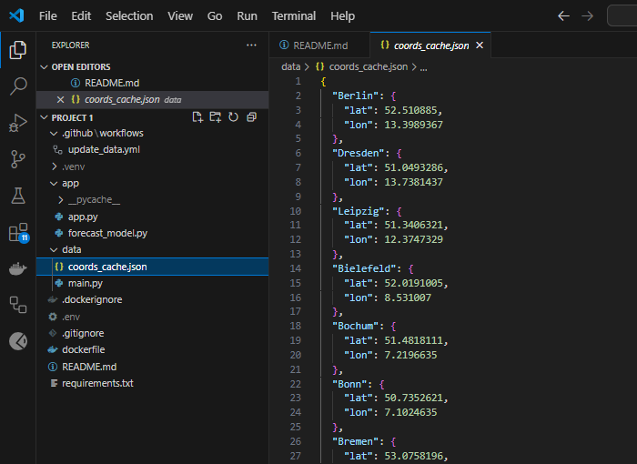
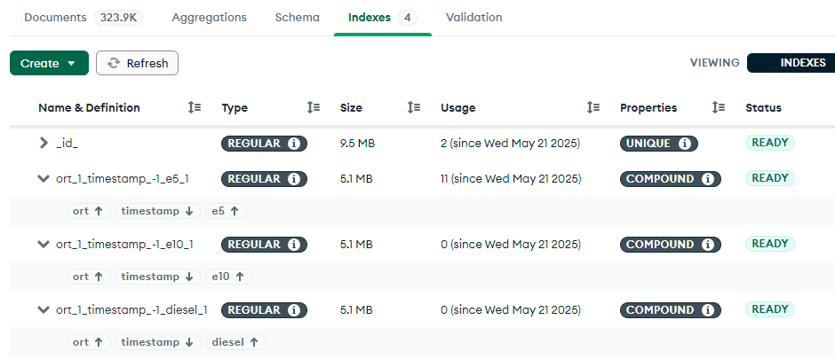
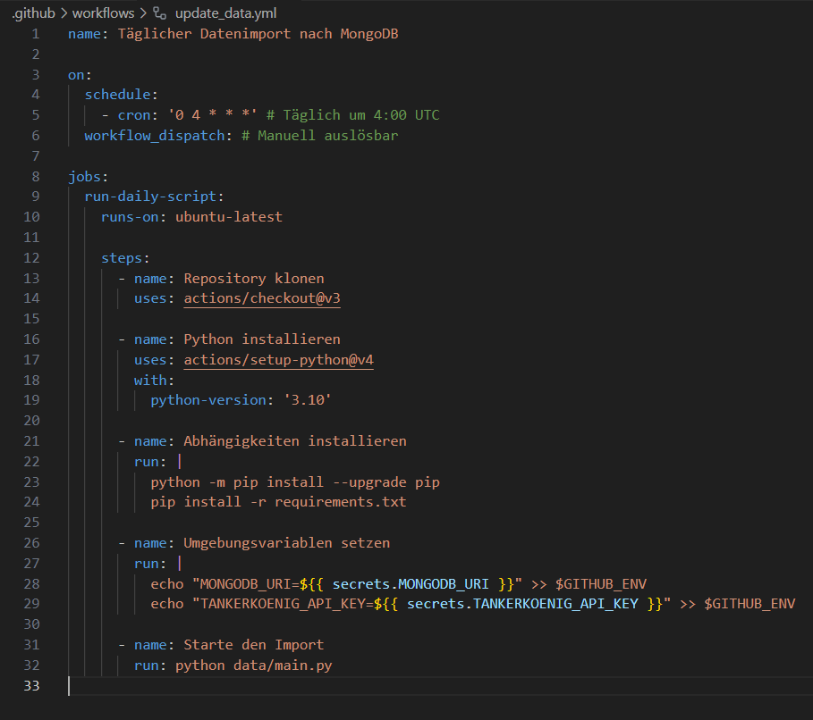
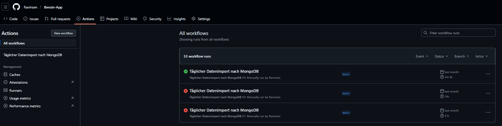
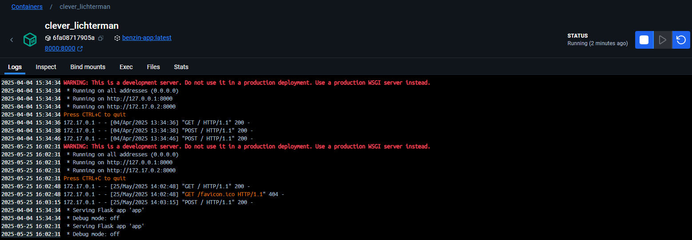
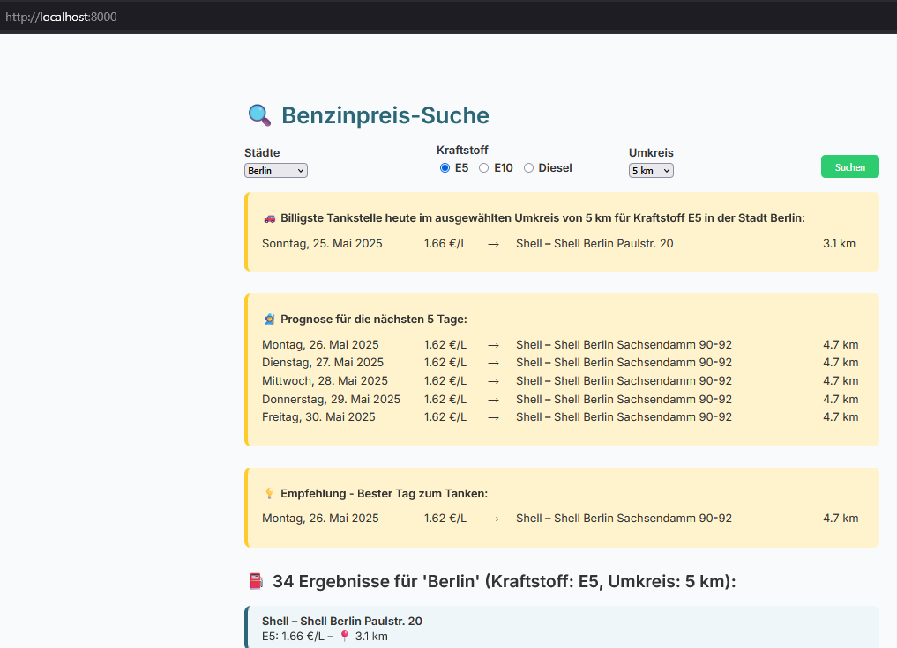
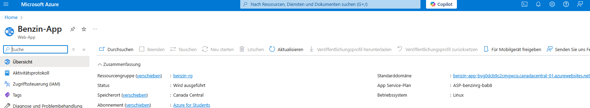
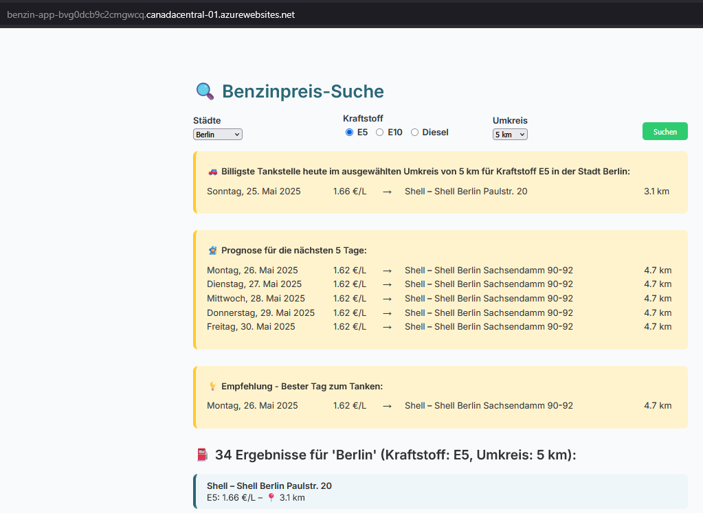

# Projekt 1 Python

## Übersicht

| | |
| -------- | ------- |
| Variante | Eigenes Projekt |
| Datenherkunft | JSON, Echtzeitdaten von API |
| Datenherkunft | https://creativecommons.tankerkoenig.de |
| ML-Algorithmus | Lineare Regression (pro Tankstelle) |
| Repo URL | https://github.com/Ravinsen/Benzin-App |

---

## Dokumentation

### Data Scraping

Für das Projekt habe ich keine statischen Daten gescraped, sondern auf die **Tankerkönig API** zugegriffen, welche Echtzeit-Daten von über 14.000 Tankstellen in Deutschland zur Verfügung stellt.


Über das Skript `data/main.py` werden täglich Daten für 20 deutsche Städte abgerufen. Die Preise werden mit einem Zeitstempel versehen und in MongoDB Atlas gespeichert.

**Genutzte Bibliotheken:**  
- `requests` für die API-Anfrage  
- `geopy` für die Koordinaten  
- `pymongo` zur Verbindung mit MongoDB

```bash
# Befehl, um die Daten zu laden in die MongoDB
python data/main.py
```

Die API-URL für jede Stadt sieht so aus:

```txt
url = https://creativecommons.tankerkoenig.de/json/list.php?lat={lat}&lng={lng}&rad=25&sort=dist&type=all&apikey={api_key}"
```


Um die Performance der App zu verbessern, werden die Geo-Koordinaten der 20 deutschen Städte nicht bei jeder Abfrage neu ermittelt, sondern lokal gecacht. Beim ersten Zugriff wird die Koordinate über die geopy-Bibliothek via Nominatim-API abgefragt und anschliessend in der Datei `coords_cache.json` gespeichert. Bei späteren Zugriffen greift das Modell dann direkt auf diesen Cache zu, wodurch externe API-Requests entfallen und die Ladezeit deutlich sinkt.



Um die Performance während Datenbankabfragen noch mehr zu verbessern, wurden in MongoDB gezielt Indexe auf die Felder `ort`, `timestamp` und die drei Kraftstoffarten (`e5`, `e10`, `diesel`) gesetzt. Diese Felder werden bei nahezu jeder Abfrage verwendet, vorallem beim Filtern nach Stadt, Datum und Preisinformationen. Durch die Indexierung konnten die Lesezeiten signifikant reduziert und die Gesamtperformance der Anwendung verbessert werden. Das ist unteranderem sehr wichtig bei wachsendem Datenvolumen.



## Training

### Architekturüberblick

Das Modell verfolgt einen **anfragegetriebenen Trainingsansatz**: Es gibt **keinen zentralen Trainingslauf**, sondern das Modell wird **on-the-fly** bei jeder Nutzeranfrage individuell für die jeweilige Tankstelle trainiert. Dabei wird ausschliesslich auf bereits in MongoDB gespeicherte Daten zurückgegriffen (siehe *Data Scraping*).

### Datengrundlage

- **Zeitraum**: Letzte 60 Tage  
- **Quelle**: MongoDB Collection `tankstellen`  
- **Filter**: Standort und Umkreis (Standard: 5 km)  
- **Kraftstofftypen**: `e5`, `e10`, `diesel`  
- **Geodaten**: Koordinatenberechnung mittels `geopy.distance.geodesic`

Nur Tankstellen mit ausreichender Datenhistorie (≥2 Tage) werden berücksichtigt.

### Feature Engineering

Aus den historischen Preisdaten wird das folgende Merkmal generiert:

```python
sub_df["day"] = (pd.to_datetime(sub_df["date"]) - pd.to_datetime(sub_df["date"]).min()).dt.days
X = sub_df["day"].values.reshape(-1, 1)
y = sub_df[kraftstoff].astype(float).values
```

### Modelltyp & Training

Für jede Tankstelle:

- **Modelltyp**: Lineare Regression (`sklearn.linear_model.LinearRegression`)
- **Trainingsprozess**: Einfacher Fit mit `X` und `y`
- **Ziel**: Prognose der Preise für die nächsten 5 Tage

```python
model = LinearRegression().fit(X, y)
future_days = np.array([sub_df["day"].max() + i for i in range(1, 6)])
preds = model.predict(future_days.reshape(-1, 1))
```

Das Modell wird nicht persistent gespeichert, da es bei jedem Aufruf neu erzeugt wird.

### Ausgabe & Visualisierung

Die Ergebnisse beinhalten:

- **Tägliche Vorhersage** der günstigsten Preise je Datum (über alle Tankstellen hinweg)
- **Zusammengeführte Daten** aus Forecast + aktuelle Preise

```python
df_combined = pd.concat([df_forecast, df_today], ignore_index=True)
```

### Empfehlungskomponente

Zusätzlich zur Prognose wird eine **empfohlene Aktion** ausgegeben:

- „Heute tanken“ vs. „Später tanken“
- Basierend auf Vergleich des aktuellen Preises mit der 5-Tages-Prognose
- Information enthält Name, Marke, Distanz und Datum des besten Preises

```python
best_entry = df_combined.loc[df_combined["price"].idxmin()]
recommendation = {
    "date": best_entry["date"].strftime("%A, %d. %B %Y"),
    "price": best_entry["price"],
    "name": best_entry["name"],
    "brand": best_entry["brand"],
    "distance": best_entry.get("distance", None)
}
```


---
## ModelOps Automation

Die Anwendung aktualisiert sich täglich automatisch über **GitHub Actions**. Der Workflow liegt unter `.github/workflows/update_data.yml`.

### Zeitplan
Der Job läuft jeden Tag um **04:00 UTC** (05:00 MEZ):

```yaml
cron: '0 4 * * *'
```

### Wichtige Schritte im Workflow

1. Repository wird geklont (`actions/checkout@v3`)
2. Python 3.10 Umgebung wird eingerichtet
3. Alle benötigten Pakete werden über `requirements.txt` installiert
4. Umgebungsvariablen (`MONGODB_URI`, `TANKERKOENIG_API_KEY`) werden aus GitHub Secrets geladen
5. Das Skript `data/main.py` wird ausgeführt und speichert die aktuellen Kraftstoffdaten in MongoDB

### Verwendete Secrets

- `MONGODB_URI`: Verbindung zur MongoDB Atlas-Datenbank
- `TANKERKOENIG_API_KEY`: Zugriff auf Echtzeitdaten der Tankerkönig-API




## Deployment

Die App wurde vollständig containerisiert mit Docker und zunächst lokal zum Laufen gebracht.

Dockerfile-Ausschnitt:
```
FROM python:3.10-slim
RUN apt-get update && apt-get install -y locales
ENV LANG=de_DE.UTF-8
WORKDIR /app
COPY . .
RUN pip install -r requirements.txt
CMD ["python", "app/app.py"]
```

Nach dem lokalen Build wurde das Image zu Azure Container Registry gepusht:

```bash
docker build -t benzin-app:v1 .
docker tag benzin-app:v1 benzinpreisportal.azurecr.io/benzin-app:v1
docker push benzinpreisportal.azurecr.io/benzin-app:v1
```





Nachdem es Lokal einwandfrei lief wurde das Ganze auf Azure Cloud deployed. Dafür wurde über das Azure Interface eine Resourcengruppe, sowie ein App Service Plan und Webapp erstellt und deployed. Die Anwendung ist jetzt öffentlich über Azure erreichbar: https://benzin-app-bvg0dcb9c2cmgwcq.canadacentral-01.azurewebsites.net/






Anschliessend wurde das Image in Azure Web App verlinkt. Die Anwendung läuft öffentlich unter einer benutzerdefinierten Subdomain.

---

## Fazit

Das Projekt hat mir geholfen, den kompletten Lebenszyklus eines ML-Modells praktisch zu durchlaufen: Von der Datenbeschaffung über die Modellierung bis zur automatisierten Bereitstellung in der Cloud.

Besonders herausfordernd war es, die Performance durch Indexierung, Caching und datenbasierte Filterung zu optimieren. Gleichzeitig war es spannend, die täglichen Abläufe über GitHub Actions komplett zu automatisieren.
