# Projekt 2 Java

## Übersicht

| | Bitte ausfüllen |
| -------- | ------- |
| Variante | Vorhandener Datensatz |
| Datensatz | Bilddatensatz (JPG), klassifiziert nach Wetterbedingungen |
| Datensatz | 1) https://www.kaggle.com/datasets/somesh24/multiclass-images-for-weather-classification?select=dataset2<br>2) https://www.kaggle.com/datasets/jehanbhathena/weather-dataset |
| Modell (wenn selbstgewählt) | Lokal trainiertes PyTorch-Modell, exportiert als ONNX - https://github.com/Ravinsen/weather_training |
| ML-Algorithmus | Transfer Learning mit ResNet18 |
| Repo URL | https://github.com/Ravinsen/WeatherClassifier |


## Dokumentation

### Daten
Für das Projekt wurden zwei öffentlich verfügbare Datensätze von Kaggle kombiniert, um die Klassifikation von Wetterbildern zu ermöglichen.

Dataset 1 - https://www.kaggle.com/datasets/somesh24/multiclass-images-for-weather-classification?select=dataset2 - enthält die Klassen:

- cloudy
- rainy
- sunny
- sunrise

Dataset 2 -https://www.kaggle.com/datasets/jehanbhathena/weather-dataset - wurde verwendet, um zusätzliche Wetterphänomene zu integrieren:

- snowy
- rainbow
- lightning
- hail

Die Bilder liegen im JPG-Format vor und wurden lokal in passende Ordnerstrukturen überführt, damit sie mit torchvision.datasets.ImageFolder geladen werden können.

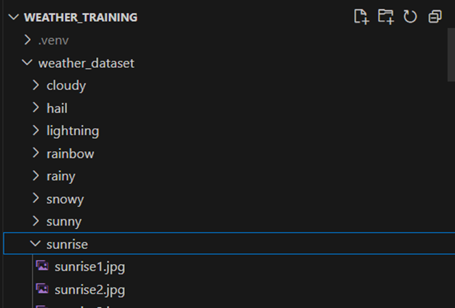

Jede Klasse enthält zwischen 50–250 Bilder. Dadurch konnte ein relativ ausgewogenes Modell trainiert werden.

### Training

Das Training des Modells erfolgte in einem separaten Python-Repository mit PyTorch - https://github.com/Ravinsen/weather_training und wurde durch eine minimalistische Trainingsumgebung realisiert. Das Ziel war es ein robustes, fehlerfreies Modell für den späteren Java-Einsatz zu erstellen.

Die Umgebung wurde mit folgenden Paketen konfiguriert:

```txt
pip install torch torchvision torchaudio
pip install matplotlib scikit-learn pandas tqdm onnx
pip install notebook
```

Das Modell basiert auf ResNet18 und wurde mit PyTorch mittels Transfer Learning angepasst.

Die Trainingsumgebung bestand aus:

- 8 Klassen
- Fine-Tuning von resnet18 auf 5 Epochen
- Verwendung von CrossEntropyLoss und Adam-Optimizer
- Accuracy nach 5 Epochen: ca. 86 %

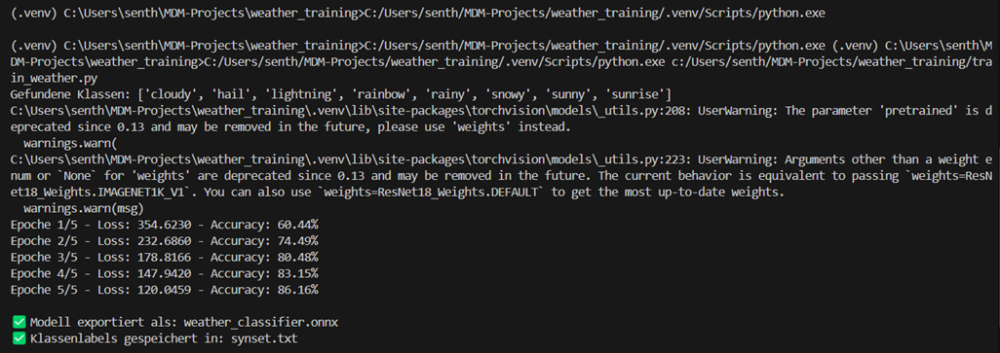

Nach dem Training wurde das Modell mithilfe von `torch.onnx.export(...)` in das ONNX-Format überführt, um es später mit DJL in Java nutzen zu können.

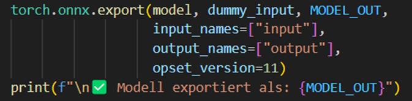


### Inference / Serving

Die Inferenz findet in einer Spring Boot Anwendung statt, die mithilfe von DJL (Deep Java Library) das ONNX-Modell lädt und verarbeitet.

Beim Start wird das Modell geladen und ein `Predictor<Image, Classifications>` erzeugt. Dabei wird die ONNX Engine verwendet und der `ImageClassificationTranslator` entsprechend konfiguriert.

```txt
Criteria<Image, Classifications> criteria = Criteria.builder()
    .optModelPath(Paths.get("src/main/resources/models/weather_classifier.onnx"))
    .optTranslator(translator)
    .optEngine("OnnxRuntime")
    .build();
```
Das synset-File (synset.txt) enthält die Klassennamen:

```txt
cloudy
hail
lightning
rainbow
rainy
snowy
sunny
sunrise
```

### Deployment

Nach erfolgreichem lokalem Test wurde die Anwendung containerisiert und via Docker Hub in die Azure Cloud deployed.

```txt
docker build -t weather-classifier .
docker run -p 8080:8080 weather-classifier
```

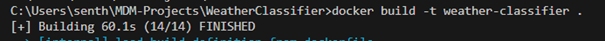
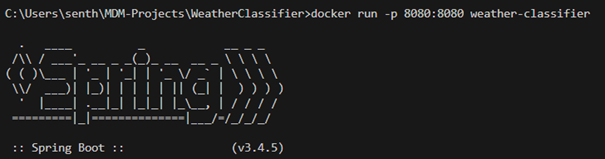

Der Container läuft lokal und ist über `http://localhost:8080` erreichbar:

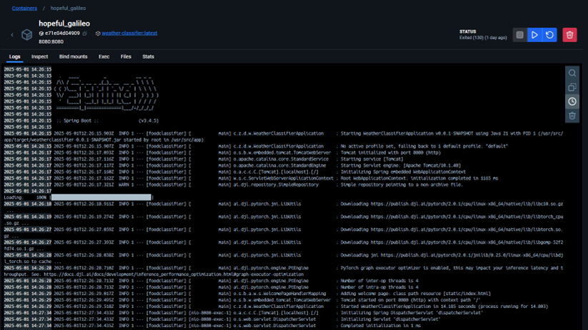

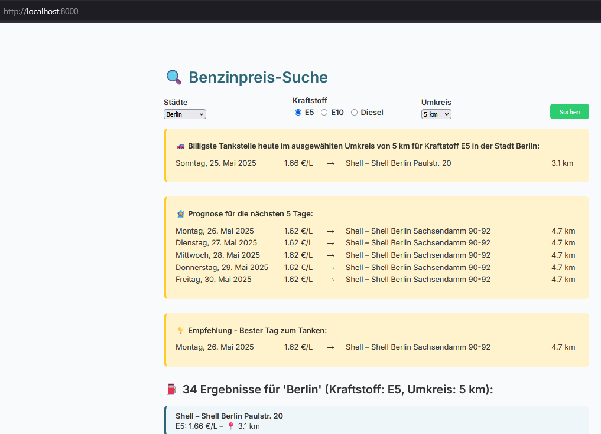

Das Image wurde anschliessend mit Tag versehen und in das eigene Docker-Hub-Repository gepusht `https://hub.docker.com/r/ravinsen/weather-classifier`:

```txt
docker login
docker tag weather-classifier ravinsen/weather-classifier:latest
docker push ravinsen/weather-classifier:latest
```

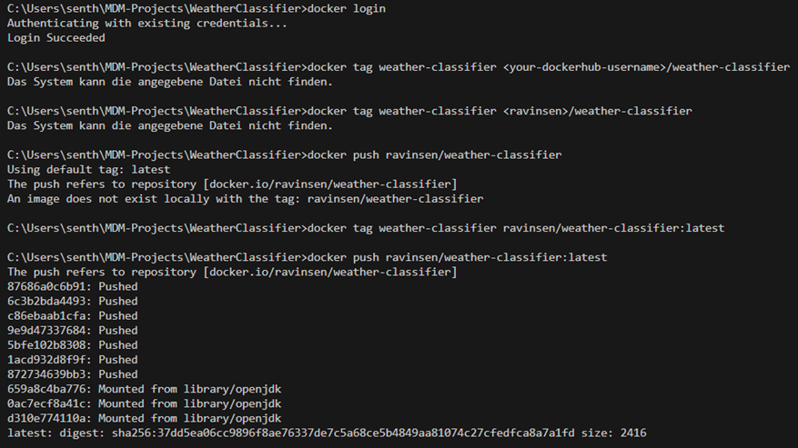

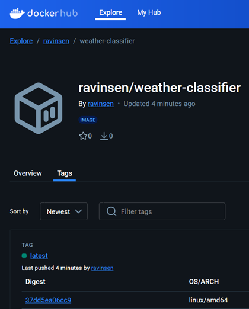

Danach wurde die Anwendung in einem Linux App Service auf Azure deployed. Die Anwendung ist jetzt öffentlich über Azure erreichbar: https://weather-djl-app.azurewebsites.net/


Die Befehle wurden mit der Azure CLI ausgeführt:

```txt
az login
az group create --name weather-rg --location southindia
az appservice plan create --name weather-plan --resource-group weather-rg --sku F1 --is-linux
az webapp create --resource-group weather-rg --plan weather-plan --name weather-djl-app --deployment-container-image-name ravinsen/weather-classifier:latest
```
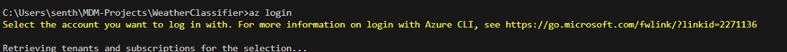

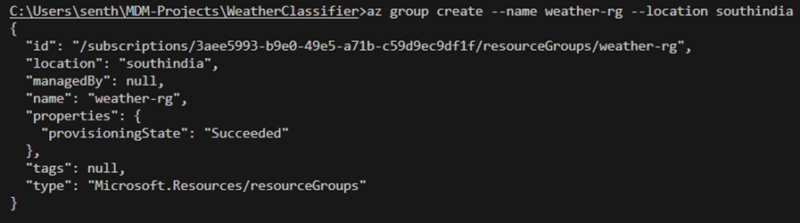

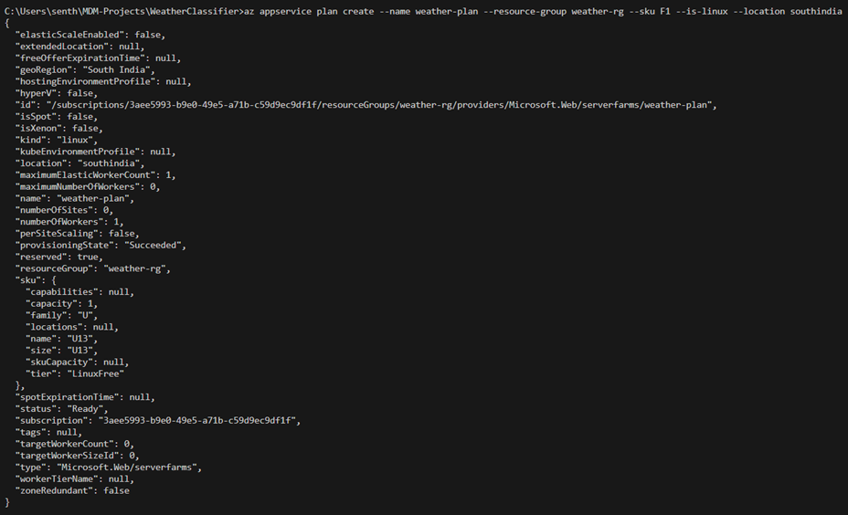

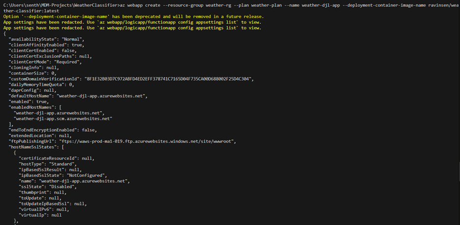
