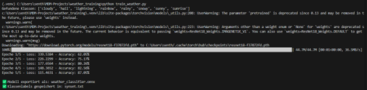

# Projekt 2 Java

## Übersicht

| | Bitte ausfüllen |
| -------- | ------- |
| Variante | Vorhandener Datensatz |
| Datensatz | Bilddatensatz (JPG), klassifiziert nach Wetterbedingungen |
| Datensatz | 1) https://www.kaggle.com/datasets/somesh24/multiclass-images-for-weather-classification?select=dataset2 2) https://www.kaggle.com/datasets/jehanbhathena/weather-dataset |
| Modell (wenn selbstgewählt) | Lokal trainiertes PyTorch-Modell, exportiert als ONNX - https://github.com/Ravinsen/weather_training |
| ML-Algorithmus | Transfer Learning mit ResNet18 |
| Repo URL | https://github.com/Ravinsen/WeatherClassifier |

## Dokumentation

### Daten
ür das Projekt wurden zwei öffentlich verfügbare Datensätze von Kaggle kombiniert, um die Klassifikation von Wetterbildern zu ermöglichen.

Dataset 1 - https://www.kaggle.com/datasets/somesh24/multiclass-images-for-weather-classification?select=dataset2 - enthält die Klassen:

- cloudy
- rainy
- sunny
- sunrise

Dataset 2 -https://www.kaggle.com/datasets/jehanbhathena/weather-dataset - wurde verwendet, um zusätzliche Wetterphänomene zu integrieren:

- snowy
- rainbow
- lightning
- hail

Die Bilder liegen im JPG-Format vor und wurden lokal in passende Ordnerstrukturen überführt, damit sie mit torchvision.datasets.ImageFolder geladen werden können.

### Training

Das Modell basiert auf ResNet18 und wurde mit PyTorch mittels Transfer Learning angepasst.
Die Trainingsumgebung bestand aus:

- 8 Klassen
- Fine-Tuning von resnet18 auf 5 Epochen
- Verwendung von CrossEntropyLoss und Adam-Optimizer
- Accuracy nach 5 Epochen: ca. 87 %
- Platzhalter für Screenshot Trainingslog:

Das trainierte Modell wurde anschließend als .onnx Datei exportiert und in ein Spring Boot Backend mit DJL integriert.

### Inference / Serving

* [ ] TODO

### Deployment

* [ ] TODO
